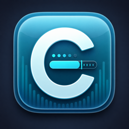
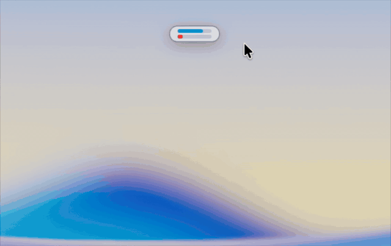
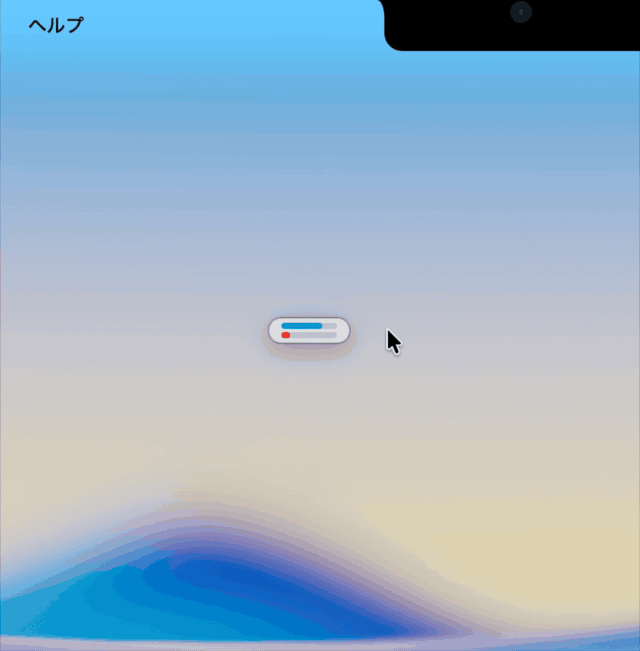
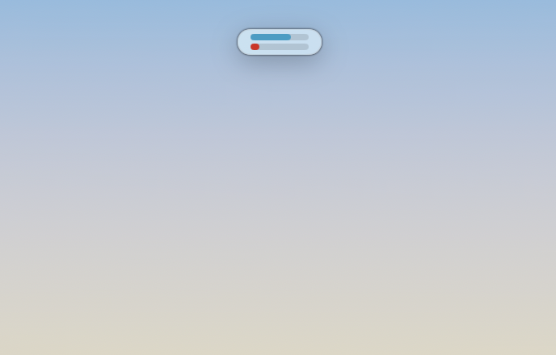
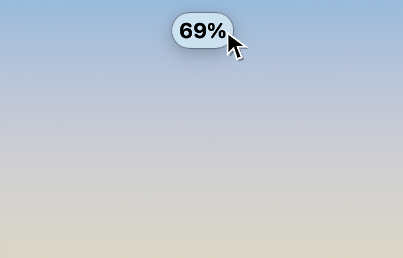
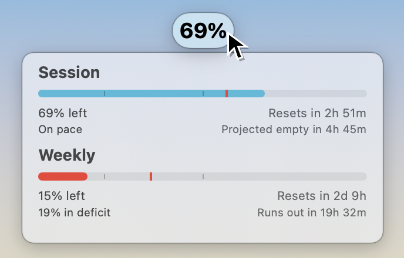
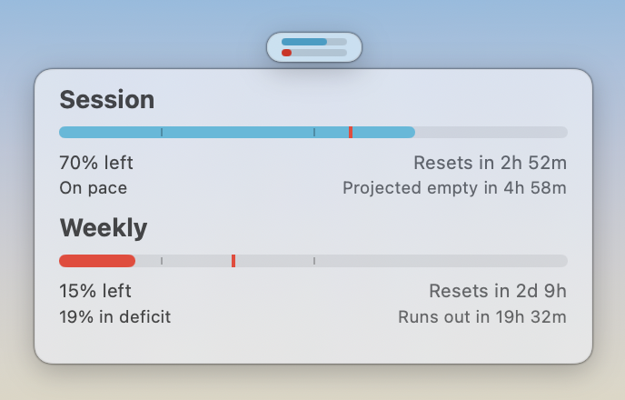

# Codex Usage Nano

<table>
  <tr>
    <td><a href="README.md">English</a></td>
    <td><strong>日本語</strong></td>
  </tr>
</table>

Version: `0.0.3`

## Codex Usage Nano は、Codex の残り使用量をすぐ確認するための小さな macOS アプリです。画面上の好きな場所に置ける小さなフローティングタブは、内側の二つのカラーバーでセッション／週次の残トークンを表示し、マウスオーバーでセッションの残トークン（%）の数字を表示します。タブをワンクリックすると、セッションと週次の詳細情報が表示されます。ミニマム設計で作業の邪魔にならず、Dock アイコンもメニューバー項目も増やしません。

<p align="center">
  
</p>

## デモ

この GIF で基本の動きが分かります。タブには 3 段階の表示形式があり、画面上の好きな場所へドラッグでき、タブをワンクリックすると詳細パネルが開きます。メニューバー項目ではないので、MacBook のノッチに隠れません。

<table>
  <tr>
    <td align="center"><strong>3 段階の表示形式</strong></td>
    <td align="center"><strong>好きな場所へ配置可能</strong></td>
  </tr>
  <tr>
    <td></td>
    <td></td>
  </tr>
</table>

タブにポインタを乗せると、コンパクトなカラーバーがセッション残量の大きな数字に変わります。タブをクリックすると詳細パネルが開閉します。カーソルをタブから離すと、タブは二つのカラーバーだけの表示に戻ります。

<table>
  <tr>
    <td align="center"><strong>最小タブ</strong></td>
    <td align="center"><strong>マウスオーバーで数値表示</strong></td>
    <td align="center"><strong>数値表示 + 詳細パネル</strong></td>
    <td align="center"><strong>詳細パネル</strong></td>
  </tr>
  <tr>
    <td></td>
    <td></td>
    <td></td>
    <td></td>
  </tr>
</table>

## 1. 概要

Codex Usage Nano は、Codex の残り使用量をすばやく確認するための軽量な macOS アプリです。中心となるのは、画面上の好きな位置へドラッグできる小さなフローティングタブです。

MacBook Air / MacBook Pro のノッチでは、メニューバーアプリが隠れて見えなくなることがあります。Codex Usage Nano はメニューバーに常駐しないことで、その問題を避けます。起動中も Dock アイコンやメニューバー項目を増やさず、小さなタブだけを表示する補助アプリとして動きます。

このアプリは [steipete/CodexBar](https://github.com/steipete/CodexBar) と一緒に使う連携アプリです。CodexBar はインストール済みである必要がありますが、Codex Usage Nano 使用中に CodexBar アプリを起動しておく必要はありません。CodexBar 本体、OpenAI 認証情報、cookie、token は同梱せず、ローカルにインストール済みの `CodexBarCLI` を呼び出して使用量を取得します。

## 2. 表示される情報

1. フローティングタブ内の二つの小さなカラーバー。上がセッション、下が週次です。
2. タブにポインタを乗せると縦に広がり、セッション残量の数字を大きく表示。
3. クリックで開く、セッションと週次の詳細パネル。
4. 各上限の残り割合、リセット時刻、ペース情報、予測表示。
5. 20% と 50% の目印が付いた使用量バー。
6. CodexBar の使用量データにペース情報がある場合に出る赤い目安線。
7. 残量に応じたバーの色。残量30%超は水色、30%以下は黄色、15%以下は赤で表示。
8. 詳細パネルの透明度を%で表示。タブの数字が黒から水色に変わり、詳細パネルの右上にも `OP 〇〇%` の表示が出ます。
9. `CodexBarCLI` が見つからない、または使用量を返せない場合の短いエラー表示。

## 3. 主な機能

1. セッションと週次の残トークンを、二つのカラーバーで見せる小さなフローティングタブ。
2. パネルを開かずにセッション残量を確認できる、マウスオーバーでの数値表示。
3. リセット時刻、ペース、予測、使用量バーを確認できるワンクリック詳細パネル。
4. MacBook のノッチに隠れない、画面上の好きな場所への配置。
5. 次回起動時にも再利用されるタブ位置。
6. ドラッグで移動でき、ドラッグでサイズ変更できる詳細パネル。
7. 60 秒ごとの自動更新と、タブメニューからの手動更新。
8. 使用量の取得は、インストール済みの `CodexBarCLI` だけを通すローカル完結の設計。

## 4. 必要なもの

1. macOS 14 以降。
2. `/Applications/CodexBar.app` にインストールされた [CodexBar](https://github.com/steipete/CodexBar)。
3. CodexBar の `codex` provider（Codex 用の取得設定）が使える状態。
4. ソースコードからビルドする場合は Swift 開発環境。

CodexBar はインストール済みである必要がありますが、Codex Usage Nano 使用中に CodexBar アプリを起動しておく必要はありません。使用量の更新時に、インストール済みの `CodexBarCLI` を直接呼び出します。

Swift の開発ツールがない場合は、先に Xcode Command Line Tools を入れてください。

```bash
xcode-select --install
```

## 5. インストール

### 5.1 リリース版を使う

1. GitHub Releases から `CodexUsageNano-0.0.3-macos.zip` をダウンロードします。
2. zip を展開します。
3. `CodexUsageNano.app` を `/Applications` に移動します。
4. `/Applications` にある `CodexUsageNano.app` をダブルクリックして起動します。

macOS が未確認アプリとして警告する場合は、System Settings > Privacy & Security から実行を許可してください。

### 5.2 ソースコードからビルドする

```bash
git clone https://github.com/AkiGarage/codex-usage-nano.git
cd codex-usage-nano
./script/build_and_run.sh --verify
ditto dist/CodexUsageNano.app /Applications/CodexUsageNano.app
open -n /Applications/CodexUsageNano.app
```

## 6. 使い方

### 6.1 起動

`/Applications`（「アプリケーション」フォルダー）にある `CodexUsageNano.app` をダブルクリックします。

ダウンロードしたアプリが未確認アプリとしてブロックされる場合は、System Settings > Privacy & Security を開いて実行を許可してください。

ターミナルから起動することもできます。

```bash
open -n /Applications/CodexUsageNano.app
```

起動すると、画面上に小さなフローティングタブが表示されます。

Codex Usage Nano 使用中に、CodexBar アプリを別途起動しておく必要はありません。使用量の更新時に、インストール済みの `CodexBarCLI` を直接呼び出します。

### 6.2 詳細パネルを開く / 閉じる

小さなタブをクリックします。

1. 1回クリック: 詳細パネルを表示。
2. もう1回クリック: 詳細パネルを非表示。

### 6.3 タブの位置を変える

タブをドラッグします。位置は保存され、次回起動時にも再利用されます。

メニューバー項目に頼らず、使用量を見やすい場所へ置けます。

タブをダブルクリックすると、詳細パネルの透明度が100%に戻り、タブと詳細パネルの位置関係もデフォルトに戻って、詳細パネルが再表示されます。

### 6.4 タブの表示を読む

通常の最小タブには 2 本の小さなカラーバーが表示されます。上がセッション、下が週次です。

タブにポインタを乗せると、横幅はそのままで縦に少し広がり、セッション残量の数字が大きく表示されます。通常の数字は黒です。

カーソルをタブから離すと、タブは二つのカラーバーだけの表示に戻ります。

### 6.5 詳細パネルを動かす / サイズ変更する

詳細パネルは、ドラッグで好きな場所に移動可能です。

詳細パネルはドラッグでサイズ変更可能です。

### 6.6 使用量を更新する

Codex Usage Nano は 60 秒ごとに自動更新します。

すぐ更新したい場合は、タブを右クリック、二本指タップ、または Control キーを押しながらクリックして、`Refresh` を選びます。

### 6.7 透明度を調整する

詳細パネル上で二本指スワイプします。調整中は詳細パネルに `OP 〇〇%` が表示され、タブの数字も黒ではなく水色になります。

タブからも透明度を調整できます。詳細パネルを透明にしすぎて操作しづらくなった場合は、タブ上で二本指スワイプするか、タブをダブルクリックすると復帰できます。

### 6.8 タブメニューを使う

タブを右クリック、二本指タップ、または Control キーを押しながらクリックするとメニューが開きます。


1. `Show Panel` / `Hide Panel`: 詳細パネルを表示または非表示にします。
2. `Refresh`: Codex 使用量をすぐ更新します。
3. `Quit Codex Usage Nano`: アプリを終了します。

### 6.9 ターミナルから終了する

```bash
pkill -x CodexUsageNano
```

## 7. ログイン時に自動起動する

1. System Settings を開く。
2. General を開く。
3. Login Items を開く。
4. `+` を押す。
5. `/Applications/CodexUsageNano.app` を選ぶ。

## 8. アンインストール

アプリを終了します。

```bash
pkill -x CodexUsageNano
```

アプリをゴミ箱に移動します。

```bash
trash /Applications/CodexUsageNano.app
```

`trash` コマンドがない場合は、Finder で `/Applications/CodexUsageNano.app` をゴミ箱に入れてください。

保存されたタブ位置とアプリ設定を削除します。

```bash
defaults delete local.codex.CodexUsageNano
```

## 9. トラブルシュート

### 9.1 `CodexBarCLI not found`

CodexBar が `/Applications/CodexBar.app` に入っているか確認してください。

```bash
ls /Applications/CodexBar.app/Contents/Helpers/CodexBarCLI
```

### 9.2 使用量が更新されない

CodexBarCLI 単体で usage が取れるか確認してください。

```bash
/Applications/CodexBar.app/Contents/Helpers/CodexBarCLI usage --provider codex --no-color
```

このコマンドが失敗する場合は、CodexBar 側の設定やログイン状態を先に確認してください。

### 9.3 タブが画面の変な場所に出る

保存された位置設定を消すと初期位置に戻ります。

```bash
defaults delete local.codex.CodexUsageNano
open -n /Applications/CodexUsageNano.app
```

### 9.4 アプリが Dock に表示されない

これは仕様です。Codex Usage Nano は macOS の補助アプリとして動くため、Dock やメニューバーを増やしません。

### 9.5 macOS がアプリをブロックする

ダウンロードしたアプリが未確認アプリとしてブロックされる場合は、System Settings > Privacy & Security を開いて実行を許可してください。

## 10. プライバシーと安全性

1. Codex Usage Nano は CodexBar のソースコードや実行ファイルを同梱しません。
2. Codex Usage Nano は OpenAI / Codex の token、cookie、password、認証情報を保存しません。
3. 使用量の取得はローカルの `/Applications/CodexBar.app/Contents/Helpers/CodexBarCLI` に委ねます。
4. このアプリは使用量データを LAN サーバーとして公開しません。

## 11. ライセンスと謝辞

Codex Usage Nano は MIT License で公開されています。詳細は [LICENSE](LICENSE) を確認してください。

Codex Usage Nano は [steipete/CodexBar](https://github.com/steipete/CodexBar) と一緒に使う連携アプリです。CodexBar も MIT License で公開されています。

## 12. 変更履歴

[CHANGELOG.md](CHANGELOG.md) を確認してください。
