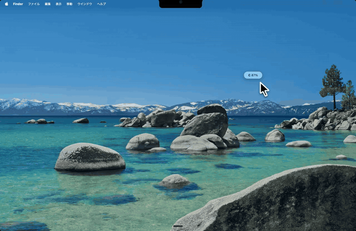

# Codex Usage Nano

<table>
  <tr>
    <td><a href="README.md">English</a></td>
    <td><strong>日本語</strong></td>
  </tr>
</table>

Version: `0.0.2`

<p align="center">
  
</p>

**MacBook の notch でメニューバーアプリが隠れる問題を避ける、小さなドラッグ可能な Codex usage tab です。上端 / メニューバー周辺を含む好きな位置に置けて、詳細は必要なときだけワンクリックで開けます。**

## Demo

この animated preview では、ドラッグできる floating tab、上端 / メニューバー周辺への配置、ワンクリックで開く詳細パネルを確認できます。メニューバー項目ではないので、notch を避けた位置へ動かせます。



<table>
  <tr>
    <td align="center"><strong>Normal</strong></td>
    <td align="center"><strong>Warning</strong></td>
    <td align="center"><strong>Critical</strong></td>
  </tr>
  <tr>
    <td></td>
    <td></td>
    <td></td>
  </tr>
</table>

## 1. 概要

Codex Usage Nano は、Codex の残り使用量をすばやく確認するための軽量な macOS アプリです。一番の特徴は、残量を表示する小さな tab を画面上の好きな位置へドラッグして置けることです。

MacBook Air / MacBook Pro の notch では、メニューバーアプリが隠れて見えなくなることがあります。Codex Usage Nano はメニューバーに常駐せず、邪魔になりにくい小さな floating tab として画面上に置けます。普段は `C 37%` のような最小表示だけを見せ、Session / Weekly の詳細は必要なときだけワンクリックで開きます。

このアプリは [steipete/CodexBar](https://github.com/steipete/CodexBar) の companion app です。CodexBar 本体や認証情報は同梱せず、ローカルにインストール済みの `CodexBarCLI` を呼び出して使用量を取得します。

## 2. 一番の特徴

1. **好きな位置に置ける:** 小さな usage tab を見やすく邪魔にならない場所へ配置できます。
2. **notch 問題を回避:** メニューバーアプリが隠れる環境でも Codex 使用量を見やすく保てます。
3. **普段は最小表示:** 通常は `C 37%` のような小さな tab だけで確認できます。
4. **詳細は必要なときだけ:** ワンクリックで Session / Weekly の詳細パネルを開けます。
5. **メニューバーを増やさない:** 追加のメニューバー項目なしで Codex 使用量を確認できます。

## 3. 主な機能

1. ドラッグできる floating tab
2. Session と Weekly の残り使用量
3. リセットまでの時間、消費ペース、projected empty / runs out
4. 残量に応じて cyan / yellow / red に変わる usage bar
5. リサイズできる詳細パネル
6. 詳細パネル上の二本指スワイプによる透明度調整
7. tab から透明度を調整可能
8. tab のダブルクリックで詳細パネルを 100% 不透明に復帰
9. 右クリック、二本指タップ、Control-click のメニューから更新と終了

## 4. 必要なもの

1. macOS 14 以降
2. [CodexBar](https://github.com/steipete/CodexBar)
3. CodexBar の `codex` provider が利用できる状態
4. source から build する場合は Swift toolchain

CodexBar は `/Applications/CodexBar.app` にインストールされている必要があります。

## 5. インストール

### 5.1 Release から使う

1. GitHub Releases から `CodexUsageNano-0.0.2-macos.zip` をダウンロードします。
2. zip を展開します。
3. `CodexUsageNano.app` を `/Applications` に移動します。
4. `/Applications` にある `CodexUsageNano.app` をダブルクリックして起動します。

macOS が未確認アプリとして警告する場合は、System Settings の Privacy & Security から実行を許可してください。

### 5.2 Source から build する

```bash
git clone <repository-url>
cd <repository-directory>
./script/build_and_run.sh --verify
ditto dist/CodexUsageNano.app /Applications/CodexUsageNano.app
open -n /Applications/CodexUsageNano.app
```

Swift toolchain がない場合は、先に Xcode Command Line Tools を入れてください。

```bash
xcode-select --install
```

## 6. 使い方

### 6.1 起動

`/Applications` にある `CodexUsageNano.app` をダブルクリックします。

Terminal から起動することもできます。

```bash
open -n /Applications/CodexUsageNano.app
```

起動すると、画面上に小さな `C <percent>%` の tab が表示されます。

### 6.2 詳細パネルを開く / 閉じる

floating tab をクリックします。

1. 1回クリック: 詳細パネルを表示
2. もう1回クリック: 詳細パネルを非表示

### 6.3 tab の位置を変える

floating tab をドラッグします。位置は保存され、次回起動時にも再利用されます。

### 6.4 詳細パネルをリサイズする

詳細パネルの角をドラッグします。パネルサイズに合わせて文字、間隔、バー、marker が縮小されます。

### 6.5 透明度を調整する

詳細パネル上で二本指スワイプします。調整中は通常の `C 97%` 表示ではなく、cyan の `OP 80%` 表示になります。

floating tab からも透明度を調整できます。詳細パネルを透明にしすぎた場合は、tab 上で二本指スワイプするか、tab をダブルクリックすると復帰できます。

### 6.6 tab メニューを使う

floating tab を右クリック、二本指タップ、または Control-click するとメニューが開きます。


1. `Show Panel` / `Hide Panel`: 詳細パネルを表示または非表示にします。
2. `Refresh`: Codex 使用量をすぐ更新します。
3. `Quit Codex Usage Nano`: アプリを終了します。

### 6.7 Terminal から終了する

```bash
pkill -x CodexUsageNano
```

## 7. ログイン時に自動起動する

1. System Settings を開く
2. General を開く
3. Login Items を開く
4. `+` を押す
5. `/Applications/CodexUsageNano.app` を選ぶ

## 8. アンインストール

```bash
pkill -x CodexUsageNano
trash /Applications/CodexUsageNano.app
defaults delete local.codex.CodexUsageNano
```

`trash` コマンドがない場合は、Finder で `/Applications/CodexUsageNano.app` をゴミ箱に入れてください。

## 9. トラブルシュート

### 9.1 `CodexBarCLI not found`

CodexBar が `/Applications/CodexBar.app` に入っているか確認してください。

```bash
ls /Applications/CodexBar.app/Contents/Helpers/CodexBarCLI
```

### 9.2 使用量が更新されない

CodexBarCLI 単体で usage が取れるか確認してください。

```bash
/Applications/CodexBar.app/Contents/Helpers/CodexBarCLI usage --provider codex --no-color
```

このコマンドが失敗する場合は、CodexBar 側の設定やログイン状態を先に確認してください。

### 9.3 tab が画面の変な場所に出る

保存された位置設定を消すと初期位置に戻ります。

```bash
defaults delete local.codex.CodexUsageNano
open -n /Applications/CodexUsageNano.app
```

## 10. プライバシー

1. CodexBar 本体、CodexBar source code、CodexBar binary は同梱していません。
2. OpenAI / Codex の token、cookie、password はこのアプリに保存しません。
3. 使用量の取得はローカルの `CodexBarCLI` に委ねています。

## 11. ライセンスと credit

Codex Usage Nano は MIT License で公開されています。詳細は [LICENSE](LICENSE) を確認してください。

Codex Usage Nano は [steipete/CodexBar](https://github.com/steipete/CodexBar) の companion app です。CodexBar は MIT License で公開されています。

## 12. Changelog

[CHANGELOG.md](CHANGELOG.md) を確認してください。
