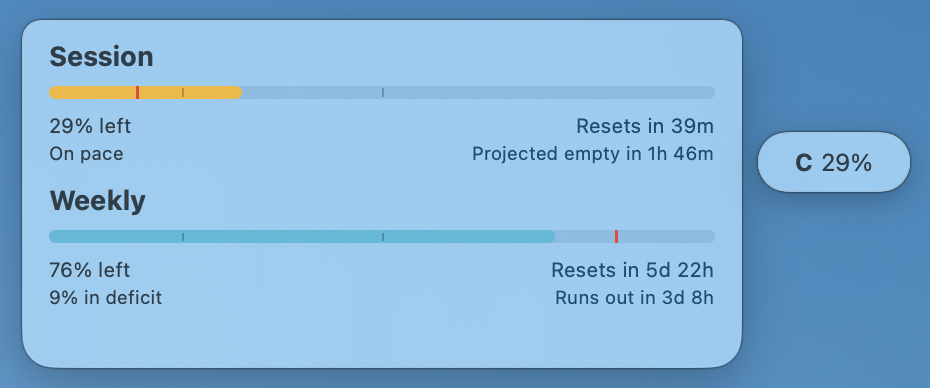

# Codex Usage Widget

[日本語](#日本語) / [English](#english)

Version: `0.0.1`

<table>
  <tr>
    <td align="center"><strong>Normal</strong></td>
    <td align="center"><strong>Warning</strong></td>
    <td align="center"><strong>Critical</strong></td>
  </tr>
  <tr>
    <td></td>
    <td></td>
    <td></td>
  </tr>
</table>

## 日本語

### 概要

Codex Usage Widget は、Codex の残り使用量をすばやく確認するための軽量な macOS アプリです。

画面上の小さな floating tab に `C 37%` のような残量を表示し、クリックすると Session / Weekly の詳細パネルを開きます。メニューバー項目を増やさず、必要なときだけ確認できることを重視しています。

このアプリは [steipete/CodexBar](https://github.com/steipete/CodexBar) の companion app です。CodexBar 本体や認証情報は同梱せず、ローカルにインストール済みの `CodexBarCLI` を呼び出して使用量を取得します。

### 主な機能

- Session と Weekly の残り使用量を表示
- リセットまでの時間、消費ペース、projected empty / runs out を表示
- 残量に応じてバーの色を cyan / yellow / red に変更
- floating tab をドラッグして好きな位置に配置
- 詳細パネルをリサイズ可能
- 二本指スワイプで詳細パネルの透明度を調整
- tab から透明度を復帰可能
- tab のダブルクリックで詳細パネルを 100% 不透明に復帰

### 必要なもの

- macOS 14 以降
- [CodexBar](https://github.com/steipete/CodexBar)
- CodexBar の `codex` provider が利用できる状態
- source から build する場合は Swift toolchain

CodexBar は `/Applications/CodexBar.app` にインストールされている必要があります。

### インストール

#### Release から使う

1. GitHub Releases から `CodexUsageWidget-0.0.1-macos.zip` をダウンロードします。
2. zip を展開します。
3. `CodexUsageWidget.app` を `/Applications` に移動します。
4. `/Applications/CodexUsageWidget.app` を開きます。

macOS が未確認アプリとして警告する場合は、System Settings の Privacy & Security から実行を許可してください。

#### Source から build する

```bash
git clone <repository-url>
cd <repository-directory>
./script/build_and_run.sh --verify
ditto dist/CodexUsageWidget.app /Applications/CodexUsageWidget.app
open -n /Applications/CodexUsageWidget.app
```

Swift toolchain がない場合は、先に Xcode Command Line Tools を入れてください。

```bash
xcode-select --install
```

### 使い方

#### 起動

```bash
open -n /Applications/CodexUsageWidget.app
```

起動すると、画面上に小さな `C <percent>%` の tab が表示されます。

#### 詳細パネルを開く / 閉じる

floating tab をクリックします。

- 1回クリック: 詳細パネルを表示
- もう1回クリック: 詳細パネルを非表示

#### 位置を変える

floating tab をドラッグします。位置は保存され、次回起動時にも再利用されます。

#### 詳細パネルをリサイズする

詳細パネルの角をドラッグします。パネルサイズに合わせて文字、間隔、バー、marker が縮小されます。

#### 透明度を調整する

詳細パネル上で二本指スワイプします。調整中は通常の `C 97%` 表示ではなく、cyan の `OP 80%` 表示になります。

透明度を下げすぎた場合は、floating tab 上で二本指スワイプするか、tab をダブルクリックすると復帰できます。

#### 手動更新

floating tab を右クリック、または Control-click して `Refresh` を選びます。

#### 終了

floating tab を右クリック、または Control-click して `Quit Codex Usage Widget` を選びます。

Terminal から終了する場合:

```bash
pkill -x CodexUsageWidget
```

### ログイン時に自動起動する

1. System Settings を開く
2. General を開く
3. Login Items を開く
4. `+` を押す
5. `/Applications/CodexUsageWidget.app` を選ぶ

### アンインストール

```bash
pkill -x CodexUsageWidget
trash /Applications/CodexUsageWidget.app
defaults delete local.codex.CodexUsageWidget
```

`trash` コマンドがない場合は、Finder で `/Applications/CodexUsageWidget.app` をゴミ箱に入れてください。

### トラブルシュート

#### `CodexBarCLI not found`

CodexBar が `/Applications/CodexBar.app` に入っているか確認してください。

```bash
ls /Applications/CodexBar.app/Contents/Helpers/CodexBarCLI
```

#### 使用量が更新されない

CodexBarCLI 単体で usage が取れるか確認してください。

```bash
/Applications/CodexBar.app/Contents/Helpers/CodexBarCLI usage --provider codex --no-color
```

このコマンドが失敗する場合は、CodexBar 側の設定やログイン状態を先に確認してください。

#### tab が画面の変な場所に出る

保存された位置設定を消すと初期位置に戻ります。

```bash
defaults delete local.codex.CodexUsageWidget
open -n /Applications/CodexUsageWidget.app
```

### プライバシー

- CodexBar 本体、CodexBar source code、CodexBar binary は同梱していません。
- OpenAI / Codex の token、cookie、password はこのアプリに保存しません。
- 使用量の取得はローカルの `CodexBarCLI` に委ねています。

### ライセンスと credit

Codex Usage Widget は MIT License で公開されています。詳細は [LICENSE](LICENSE) を確認してください。

Codex Usage Widget は [steipete/CodexBar](https://github.com/steipete/CodexBar) の companion app です。CodexBar は MIT License で公開されています。

### Changelog

[CHANGELOG.md](CHANGELOG.md) を確認してください。

## English

### Overview

Codex Usage Widget is a lightweight macOS app for checking remaining Codex usage quickly.

It shows a small floating tab such as `C 37%`. Clicking the tab opens a compact Session / Weekly usage panel. The app is designed for quick checks without adding another menu bar item.

This is a companion app for [steipete/CodexBar](https://github.com/steipete/CodexBar). It does not bundle CodexBar or credentials. It calls the locally installed `CodexBarCLI` to read usage data.

### Features

- Shows Session and Weekly remaining usage
- Shows reset time, pace, projected empty, and runs out text
- Changes the usage bar color from cyan to yellow to red as remaining usage drops
- Draggable floating tab
- Resizable detail panel
- Two-finger swipe opacity control for the detail panel
- Opacity recovery from the floating tab
- Double-click the tab to restore the detail panel to 100% opacity

### Requirements

- macOS 14 or newer
- [CodexBar](https://github.com/steipete/CodexBar)
- CodexBar configured with a working `codex` provider
- Swift toolchain if building from source

CodexBar must be installed at `/Applications/CodexBar.app`.

### Install

#### Use a release build

1. Download `CodexUsageWidget-0.0.1-macos.zip` from GitHub Releases.
2. Unzip it.
3. Move `CodexUsageWidget.app` to `/Applications`.
4. Open `/Applications/CodexUsageWidget.app`.

If macOS blocks the app as unidentified, allow it from System Settings > Privacy & Security.

#### Build from source

```bash
git clone <repository-url>
cd <repository-directory>
./script/build_and_run.sh --verify
ditto dist/CodexUsageWidget.app /Applications/CodexUsageWidget.app
open -n /Applications/CodexUsageWidget.app
```

If Swift tools are missing, install Xcode Command Line Tools first.

```bash
xcode-select --install
```

### Usage

#### Launch

```bash
open -n /Applications/CodexUsageWidget.app
```

The app shows a small `C <percent>%` tab on screen.

#### Show or hide the detail panel

Click the floating tab.

- First click: show the detail panel
- Second click: hide the detail panel

#### Move the tab

Drag the floating tab. The position is saved and reused on next launch.

#### Resize the panel

Drag a panel corner. Text, spacing, bars, and markers scale with the panel.

#### Adjust opacity

Two-finger swipe over the detail panel. While adjusting opacity, the tab changes from the normal `C 97%` display to a cyan `OP 80%` display.

If the panel becomes too transparent, two-finger swipe on the floating tab or double-click the tab to recover it.

#### Refresh

Right-click or Control-click the floating tab, then choose `Refresh`.

#### Quit

Right-click or Control-click the floating tab, then choose `Quit Codex Usage Widget`.

To quit from Terminal:

```bash
pkill -x CodexUsageWidget
```

### Launch at login

1. Open System Settings
2. Open General
3. Open Login Items
4. Click `+`
5. Select `/Applications/CodexUsageWidget.app`

### Uninstall

```bash
pkill -x CodexUsageWidget
trash /Applications/CodexUsageWidget.app
defaults delete local.codex.CodexUsageWidget
```

If `trash` is not installed, move `/Applications/CodexUsageWidget.app` to Trash from Finder.

### Troubleshooting

#### `CodexBarCLI not found`

Make sure CodexBar is installed at `/Applications/CodexBar.app`.

```bash
ls /Applications/CodexBar.app/Contents/Helpers/CodexBarCLI
```

#### Usage does not update

Check CodexBarCLI directly.

```bash
/Applications/CodexBar.app/Contents/Helpers/CodexBarCLI usage --provider codex --no-color
```

If this command fails, fix the CodexBar configuration or login state first.

#### The tab appears in a strange place

Reset the saved position.

```bash
defaults delete local.codex.CodexUsageWidget
open -n /Applications/CodexUsageWidget.app
```

### Privacy

- This app does not bundle CodexBar source code or binaries.
- This app does not store OpenAI / Codex tokens, cookies, or passwords.
- Usage data retrieval is delegated to the local `CodexBarCLI`.

### License and credit

Codex Usage Widget is released under the MIT License. See [LICENSE](LICENSE).

Codex Usage Widget is a companion app for [steipete/CodexBar](https://github.com/steipete/CodexBar), which is also released under the MIT License.

### Changelog

See [CHANGELOG.md](CHANGELOG.md).
