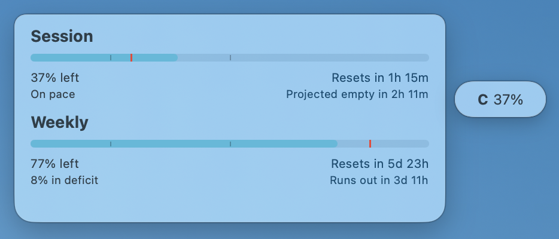
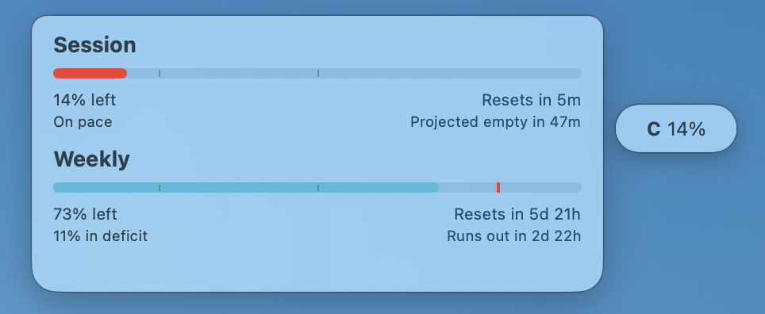
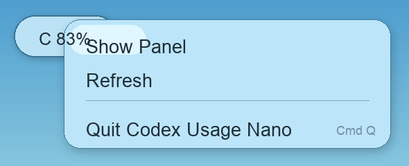

# Codex Usage Nano

<table>
  <tr>
    <td><strong>English</strong></td>
    <td><a href="README.ja.md">日本語</a></td>
  </tr>
</table>

Version: `0.0.2`

**A tiny draggable Codex usage tab for notched MacBooks. Put it anywhere, keep it out of the menu bar, and open details only when you need them.**

<table>
  <tr>
    <td align="center"><strong>Normal</strong></td>
    <td align="center"><strong>Warning</strong></td>
    <td align="center"><strong>Critical</strong></td>
  </tr>
  <tr>
    <td></td>
    <td></td>
    <td></td>
  </tr>
</table>

## 1. Overview

Codex Usage Nano is a lightweight macOS app for checking remaining Codex usage quickly. Its main feature is a tiny usage tab that you can drag anywhere on screen.

On notched MacBook Air and MacBook Pro displays, menu bar apps can disappear behind the notch. Codex Usage Nano avoids that problem by staying out of the menu bar. It keeps a small, unobtrusive floating tab on screen, shows only a compact `C 37%` value by default, and opens the Session / Weekly detail panel with one click when you need it.

This is a companion app for [steipete/CodexBar](https://github.com/steipete/CodexBar). It does not bundle CodexBar or credentials. It calls the locally installed `CodexBarCLI` to read usage data.

## 2. Main Benefit

1. **Drag it anywhere:** put the tiny usage tab where it is visible and out of the way.
2. **Avoid the notch problem:** keep Codex usage visible even when menu bar apps would be hidden.
3. **Stay minimal:** use the compact `C 37%` tab for normal checking.
4. **Open details only when needed:** one click opens the Session / Weekly panel.
5. **Avoid menu bar clutter:** no extra menu bar item is required.

## 3. Features

1. Draggable floating tab
2. Session and Weekly remaining usage
3. Reset time, pace, projected empty, and runs out text
4. Usage bars that change from cyan to yellow to red as remaining usage drops
5. Resizable detail panel
6. Detail-panel opacity adjustment with a two-finger swipe
7. Opacity adjustment from the tab
8. Double-click the tab to restore the detail panel to 100% opacity
9. Right-click, two-finger tap, or Control-click menu for refresh and quit

## 4. Requirements

1. macOS 14 or newer
2. [CodexBar](https://github.com/steipete/CodexBar)
3. CodexBar configured with a working `codex` provider
4. Swift toolchain if building from source

CodexBar must be installed at `/Applications/CodexBar.app`.

## 5. Install

### 5.1 Use a Release Build

1. Download `CodexUsageNano-0.0.2-macos.zip` from GitHub Releases.
2. Unzip it.
3. Move `CodexUsageNano.app` to `/Applications`.
4. Double-click `CodexUsageNano.app` in `/Applications` to launch it.

If macOS blocks the app as unidentified, allow it from System Settings > Privacy & Security.

### 5.2 Build from Source

```bash
git clone <repository-url>
cd <repository-directory>
./script/build_and_run.sh --verify
ditto dist/CodexUsageNano.app /Applications/CodexUsageNano.app
open -n /Applications/CodexUsageNano.app
```

If Swift tools are missing, install Xcode Command Line Tools first.

```bash
xcode-select --install
```

## 6. Usage

### 6.1 Launch

Double-click `CodexUsageNano.app` in `/Applications`.

You can also launch it from Terminal:

```bash
open -n /Applications/CodexUsageNano.app
```

The app shows a small `C <percent>%` tab on screen.

### 6.2 Show or Hide the Detail Panel

Click the floating tab.

1. First click: show the detail panel
2. Second click: hide the detail panel

### 6.3 Move the Tab

Drag the floating tab. The position is saved and reused on next launch.

### 6.4 Resize the Detail Panel

Drag a panel corner. Text, spacing, bars, and markers scale with the panel.

### 6.5 Adjust Opacity

Two-finger swipe over the detail panel. While adjusting opacity, the tab changes from the normal `C 97%` display to a cyan `OP 80%` display.

You can also adjust opacity from the floating tab. If the panel becomes too transparent, two-finger swipe on the tab or double-click the tab to recover it.

### 6.6 Use the Tab Menu

Right-click, two-finger tap, or Control-click the floating tab to open the menu.



1. `Show Panel` / `Hide Panel`: show or hide the detail panel.
2. `Refresh`: update Codex usage immediately.
3. `Quit Codex Usage Nano`: quit the app.

### 6.7 Quit from Terminal

```bash
pkill -x CodexUsageNano
```

## 7. Launch at Login

1. Open System Settings.
2. Open General.
3. Open Login Items.
4. Click `+`.
5. Select `/Applications/CodexUsageNano.app`.

## 8. Uninstall

```bash
pkill -x CodexUsageNano
trash /Applications/CodexUsageNano.app
defaults delete local.codex.CodexUsageNano
```

If `trash` is not installed, move `/Applications/CodexUsageNano.app` to Trash from Finder.

## 9. Troubleshooting

### 9.1 `CodexBarCLI not found`

Make sure CodexBar is installed at `/Applications/CodexBar.app`.

```bash
ls /Applications/CodexBar.app/Contents/Helpers/CodexBarCLI
```

### 9.2 Usage Does Not Update

Check CodexBarCLI directly.

```bash
/Applications/CodexBar.app/Contents/Helpers/CodexBarCLI usage --provider codex --no-color
```

If this command fails, fix the CodexBar configuration or login state first.

### 9.3 The Tab Appears in a Strange Place

Reset the saved position.

```bash
defaults delete local.codex.CodexUsageNano
open -n /Applications/CodexUsageNano.app
```

## 10. Privacy

1. This app does not bundle CodexBar source code or binaries.
2. This app does not store OpenAI / Codex tokens, cookies, or passwords.
3. Usage data retrieval is delegated to the local `CodexBarCLI`.

## 11. License and Credit

Codex Usage Nano is released under the MIT License. See [LICENSE](LICENSE).

Codex Usage Nano is a companion app for [steipete/CodexBar](https://github.com/steipete/CodexBar), which is also released under the MIT License.

## 12. Changelog

See [CHANGELOG.md](CHANGELOG.md).
